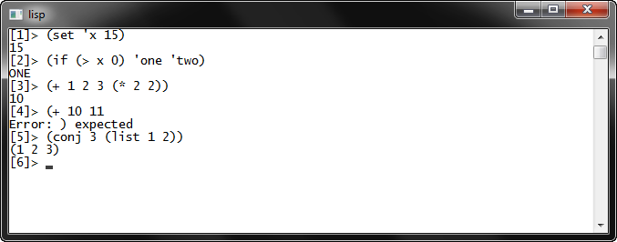

# Interpret podmnožiny jazyka Lisp

Semestrální práce z předmětu KIV/PC.

Napsáno v ANSI C, kód je plně přenositelný (testováno na Windows a Linux).
Jsou implementovány pouze základní funkce a jen některé datové typy.
Jinak bych řekl, že je to navržené jak se na interpret patří.

Více informací v [dokumentaci](doc/kiv-pc-sp.pdf).

