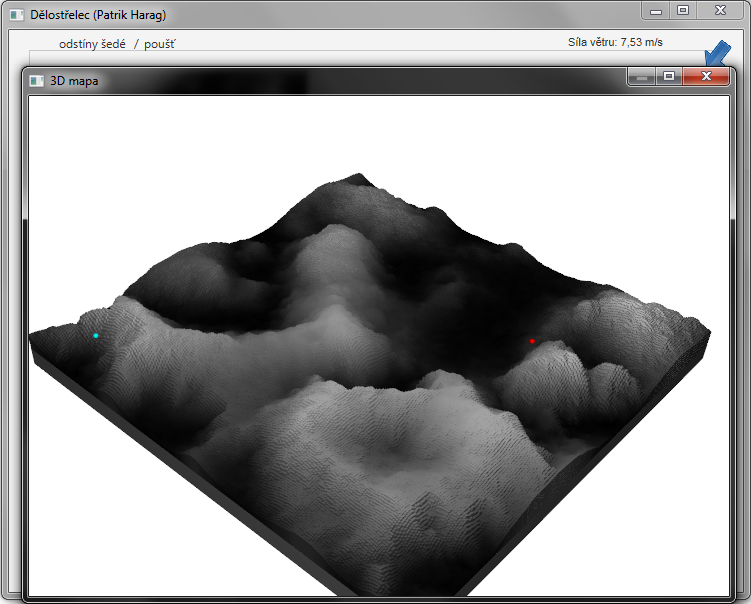

## Semestrální práce

**Zadání**
> Úkolem samostatné práce je vytvořit hru „dělostřelec“. Hráč vidí hrací plochu z výšky (půdorys), na hracím poli se
> nachází dělostřelec a cíl. Hráčovým úkolem je zasáhnout cíl. Hráč bude mít k dispozici vizualizace (2D grafy) které mu
> pomohou s výběrem parametrů každého výstřelu (azimut, elevace, úsťová rychlost střely).

Další podrobnosti v [uživatelské dokumentaci](doc/documentation.pdf).

